# Brave Browser OBS Package

<div align="center">

[](https://build.opensuse.org/package/show/home:itachi_re/brave-browser)
[](https://github.com/itachi-re/brave-browser-obs/actions)
[](LICENSE)
[](https://github.com/itachi-re/brave-browser-obs)

**Automated, production-ready Brave Browser packages for RPM-based Linux distributions**

[Installation](#-installation) • [Features](#-features) • [Building](#-building-locally) • [Contributing](#-contributing) • [Support](#-support)

</div>

---

## 📖 Overview

This repository provides **automated packaging infrastructure** for [Brave Browser](https://brave.com/) on the [Open Build Service (OBS)](https://openbuildservice.org/). It delivers clean, well-maintained RPM packages that track official Brave releases with zero manual intervention.

### Why This Package?

- 🤖 **Zero Maintenance**: Fully automated version tracking and building
- 🎯 **Upstream Fidelity**: Uses official Brave binaries—no custom patches
- 🔒 **Security First**: Proper sandboxing, permissions, and hardening applied
- 📦 **Distribution Native**: Integrates seamlessly with system package managers
- 🧪 **Quality Tested**: Comprehensive linting and multi-architecture validation

---

## 🚀 Features

| Feature | Description |
|---------|-------------|
| **Automatic Updates** | GitHub Actions monitors Brave releases daily and updates packaging automatically |
| **Multi-Distribution** | Builds for openSUSE Tumbleweed, Leap 15.5+, Fedora 38+, and compatible distributions |
| **Binary Repackaging** | Repackages official Brave RPMs with essential fixes for better system integration |
| **Quality Assurance** | Integrated `rpmlint` checks with curated rule filters for clean builds |
| **Multi-Architecture** | Native support for x86_64 and aarch64 architectures |
| **Transparent Process** | All modifications documented and version-controlled |

---

## 💻 Installation

### One-Click Installation (openSUSE/Fedora)

**openSUSE Tumbleweed/Leap:**
```bash
# Add repository
sudo zypper ar -cfp 90 'https://download.opensuse.org/repositories/home:/itachi_re/openSUSE_Tumbleweed/' brave-browser

# Trust GPG key
sudo zypper ref

# Install Brave
sudo zypper in brave-browser
```

**Fedora 38+:**
```bash
# Add repository
sudo dnf config-manager --add-repo 'https://download.opensuse.org/repositories/home:/itachi_re/Fedora_38/home:itachi_re.repo'

# Install Brave
sudo dnf install brave-browser
```

### Manual RPM Download

Download the latest RPM for your distribution from the [OBS package page](https://build.opensuse.org/package/show/home:itachi_re/brave-browser) and install:

```bash
sudo rpm -ivh brave-browser-*.rpm
```

---

## 📦 Supported Distributions

<table>
<tr>
<td>

**openSUSE**
- Tumbleweed (rolling)
- Leap 15.5
- Leap 15.6

</td>
<td>

**Fedora**
- Fedora 38
- Fedora 39
- Fedora 40+

</td>
<td>

**Community**
- RHEL 9+
- Rocky Linux
- AlmaLinux

</td>
</tr>
</table>

---

## 🔧 How It Works

### Automated Release Pipeline

```mermaid
graph TB
    A[🔍 GitHub Action<br/>Daily Schedule] --> B{New Brave<br/>Release?}
    B -->|Yes| C[📝 Update .spec<br/>Version & URLs]
    B -->|No| D[⏭️ Skip]
    C --> E[💾 Git Commit]
    E --> F[🚀 Push to GitHub]
    F --> G[🔔 OBS Webhook]
    G --> H[🏗️ OBS Build Service]
    H --> I[📦 Build All Targets]
    I --> J[✅ Publish Repos]
```



### OBS Build Workflow


---

## 📁 Repository Structure

```
brave-browser-obs/
├── .github/
│   └── workflows/
│       └── updater.yml              # Automated version checker & updater
│
├── brave-browser.spec               # RPM specification with build instructions
├── _service                         # OBS source service (fetches upstream RPM)
├── brave-browser.rpmlintrc          # Linting rules and false positive filters
├── LICENSE                          # MIT License
└── README.md                        # This file
```

### Key Files Explained

| File | Purpose |
|------|---------|
| `brave-browser.spec` | RPM build recipe with version, dependencies, and install scripts |
| `_service` | OBS automation that downloads official Brave RPM on each build |
| `brave-browser.rpmlintrc` | Filters for known acceptable warnings (e.g., binary-only package) |
| `.github/workflows/updater.yml` | Checks Brave's release API and updates spec file automatically |

---

## 🛠️ Building Locally

### Prerequisites

Install OBS command-line tools and build dependencies:

**openSUSE:**
```bash
sudo zypper install osc build rpmdevtools rpmlint
```

**Fedora:**
```bash
sudo dnf install osc rpm-build rpmdevtools rpmlint
```

### Clone and Build

```bash
# Clone the GitHub repository
git clone https://github.com/itachi-re/brave-browser-obs.git
cd brave-browser-obs

# Or checkout directly from OBS
osc checkout home:itachi_re/brave-browser
cd home:itachi_re/brave-browser

# Build for your distribution
osc build openSUSE_Tumbleweed x86_64
# or
osc build Fedora_39 x86_64

# Test package quality
rpmlint brave-browser.spec
```

### Local RPM Build (Without OBS)

```bash
# Set up RPM build environment
rpmdev-setuptree

# Copy spec file
cp brave-browser.spec ~/rpmbuild/SPECS/

# Download source (replace URL with current version)
cd ~/rpmbuild/SOURCES
wget https://github.com/brave/brave-browser/releases/download/vX.Y.Z/brave-browser-X.Y.Z-1.x86_64.rpm

# Build
cd ~/rpmbuild/SPECS
rpmbuild -ba brave-browser.spec
```

---

## 🔍 Package Modifications

This repackaging applies **minimal, essential fixes** to the official Brave RPM:

### Applied Fixes

| Modification | Reason |
|-------------|---------|
| ✅ **Desktop Entry Validation** | Ensures `.desktop` file has proper `Type=Application` for menu integration |
| ✅ **Sandbox Permissions** | Sets `chrome-sandbox` binary to `4755` for proper security containment |
| ✅ **Cron Job Removal** | Removes Brave's auto-updater cron (conflicts with system package management) |
| ✅ **Duplicate File Cleanup** | Uses `fdupes` to hardlink identical man pages (saves space) |
| ✅ **Dependency Fixes** | Resolves library conflicts for better multi-distribution compatibility |
| ✅ **Icon Cache Updates** | Triggers proper icon theme cache refresh post-install |

### What's NOT Modified

- ❌ Browser binaries (unmodified)
- ❌ Browser features or functionality
- ❌ Telemetry settings (user choice preserved)
- ❌ Update mechanisms (handled by package manager)

---

## 📊 Quality Assurance

### Build Validation

- **Automated Linting**: `rpmlint` runs on every build with curated filters
- **Multi-Architecture**: Tested on x86_64 and aarch64
- **Dependency Checking**: OBS validates all runtime requirements
- **Post-Install Testing**: Scripts validated for proper file placement

### Rpmlint Configuration

Filtered warnings (legitimate for binary repackaging):
```ini
# Binary packages don't have sources
addFilter("no-changelogname-tag")
addFilter("invalid-url")
addFilter("wrong-arch")

# Expected for closed-source browser
addFilter("unstripped-binary-or-object")
addFilter("position-independent-executable-suggested")
```

---

## 🤝 Contributing

Contributions are welcome! Here's how you can help:

### Reporting Issues

Found a problem? [Open an issue](https://github.com/itachi-re/brave-browser-obs/issues) with:
- Distribution and version (e.g., "openSUSE Tumbleweed")
- Error messages or unexpected behavior
- Steps to reproduce

### Suggesting Improvements

Have ideas for:
- Supporting additional distributions?
- Improving build scripts?
- Enhancing automation?

Open a [GitHub discussion](https://github.com/itachi-re/brave-browser-obs/discussions) or pull request!

### Pull Request Guidelines

1. Fork the repository
2. Create a feature branch (`git checkout -b feature/improvement`)
3. Test your changes locally with `osc build`
4. Validate with `rpmlint`
5. Submit PR with clear description

---

## 📊 Version Management

| Aspect | Details |
|--------|---------|
| **Version Format** | `X.Y.Z-R` (e.g., `1.63.169-1`) |
| **Version Source** | Tracks [Brave's GitHub releases](https://github.com/brave/brave-browser/releases) |
| **Update Frequency** | Daily automated checks at 00:00 UTC |
| **Release Numbering** | Resets to `-1` for each new upstream version |
| **Changelog** | Maintained automatically in spec file |
| **Rollback** | All versions preserved in Git history |

---

## 🔗 Links & Resources

<table>
<tr>
<td>

**Official Brave**
- [🌐 Website](https://brave.com/)
- [📖 Documentation](https://support.brave.com/)
- [🐛 Issues](https://github.com/brave/brave-browser/issues)

</td>
<td>

**This Package**
- [📦 OBS Page](https://build.opensuse.org/package/show/home:itachi_re/brave-browser)
- [💻 GitHub Repo](https://github.com/itachi-re/brave-browser-obs)
- [🤖 Build Status](https://build.opensuse.org/package/show/home:itachi_re/brave-browser)

</td>
<td>

**Community**
- [📋 OBS Documentation](https://openbuildservice.org/help/)
- [🐧 openSUSE Forums](https://forums.opensuse.org/)
- [💬 Brave Community](https://community.brave.com/)

</td>
</tr>
</table>

---

## 📄 License

This packaging project is licensed under the **MIT License** - see the [LICENSE](LICENSE) file.

### Licensing Notes

- **Packaging Scripts**: MIT License (this repository)
- **Brave Browser**: [Mozilla Public License 2.0](https://www.mozilla.org/en-US/MPL/2.0/)
- **Trademarks**: "Brave" and the Brave logo are trademarks of Brave Software, Inc.

---

## 🙏 Acknowledgments

- **Brave Software** for creating an excellent privacy-focused browser
- **openSUSE Build Service** for providing free packaging infrastructure
- **RPM Community** for packaging standards and tools
- **Contributors** who report issues and suggest improvements

---

## 📧 Support & Contact

**Maintainer**: itachi_re  
**Email**: [itachi_re@protonmail.com](mailto:itachi_re@protonmail.com)  
**GitHub**: [@itachi-re](https://github.com/itachi-re)

### Getting Help

- **Package Issues**: [GitHub Issues](https://github.com/itachi-re/brave-browser-obs/issues)
- **Build Problems**: [OBS Package Page](https://build.opensuse.org/package/show/home:itachi_re/brave-browser)
- **Brave Browser Issues**: [Official Brave Support](https://support.brave.com/)

---

<div align="center">

**⭐ Star this repo if you find it useful!**

Made with ❤️ for the Linux community

</div>
